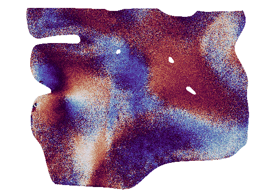
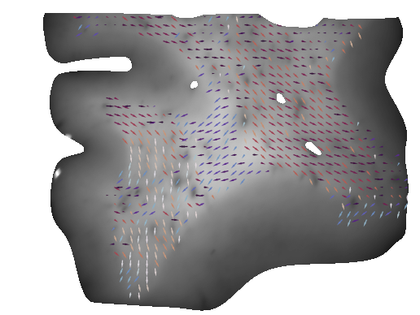

# mm_torch: Mueller matrix library for PyTorch

## Description

This repository provides Mueller Matrix computations for PyTorch featuring the Lu-Chipman decomposition. A reference implementation can be found in the [polar_segment repo](https://www.github.com/hahnec/polar_segment). Specifically, the [infer.py](https://github.com/hahnec/polar_segment/blob/master/infer.py) file shows how a mueller matrix model is initialized and the [train.py](https://github.com/hahnec/polar_segment/blob/master/train.py) file contains a more elaborate usage for plotting image results.

## Exemplary plots showing azimuth and brain fiber tracts

|  |  |
|:--------------------------:|:--------------------------:|
| **Azimuth angle map** | **Fiber tract map** |

 

  

## Publications

### IEEE Trans. on Image Processing

<pre>@ARTICLE{11202388,

  author={Hahne, Christopher and Rodríguez-Núñez, Omar and Gros, Éléa and Lucas, Théotim and Hewer, Ekkehard and Novikova, Tatiana and Maragkou, Theoni and Schucht, Philippe and McKinley, Richard},
  journal={IEEE Transactions on Image Processing}, 
  title={Physically Consistent Image Augmentation for Deep Learning in Mueller Matrix Polarimetry}, 
  year={2025},
  volume={34},
  number={},
  pages={6953-6962},
  keywords={Imaging;Polarimetry;Deep learning;Data augmentation;Training;Optical polarization;Optical imaging;Vectors;Interpolation;Standards;Augmentation;polarimetry;Mueller matrix;tumor;classification},
  doi={10.1109/TIP.2025.3618390}
}</pre>

### Optics Express

<pre>@article{hahne:2025:polar_segment,
  author={Christopher Hahne and Ivan Diaz and Omar Rodriguez-Nuñez and Éléa Gros and Muriel Blatter and Théotim Lucas and David Hasler and Tatiana Novikova and Theoni Maragkou and Philippe Schucht and Richard McKinley},
  journal={Optics Express}, 
  title={Polarimetric feature analysis of Mueller matrices for brain tumor image segmentation},
  year={2025},
  volume={33},
  number={20},
  pages={1-14},
  keywords={Mueller matrix polarimetry, brain tumor segmentation, deep learning, medical diagnostics},
  doi={https://doi.org/10.1364/OE.561518}
}</pre>
