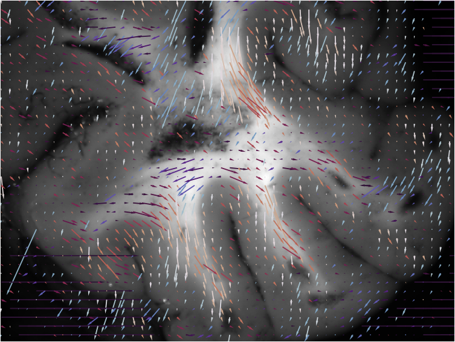

# mm_torch: Mueller matrix library for PyTorch

## Description

This repository provides Mueller Matrix computations for PyTorch featuring the Lu-Chipman decomposition. 

## Example showing brain fiber tracts

 

  

## Citation

<pre>@misc{hahne2024isometrictransformationsimageaugmentation,
      title={Physically Consistent Image Augmentation for Deep Learning in Mueller Matrix Polarimetry}, 
      author={Christopher Hahne and Omar Rodriguez-Nunez and Éléa Gros and Théotim Lucas and Ekkehard Hewer and Tatiana Novikova and Theoni Maragkou and Philippe Schucht and Richard McKinley},
      year={2024},
      eprint={2411.07918},
      archivePrefix={arXiv},
      primaryClass={cs.CV},
      url={https://arxiv.org/abs/2411.07918}, 
} </pre>